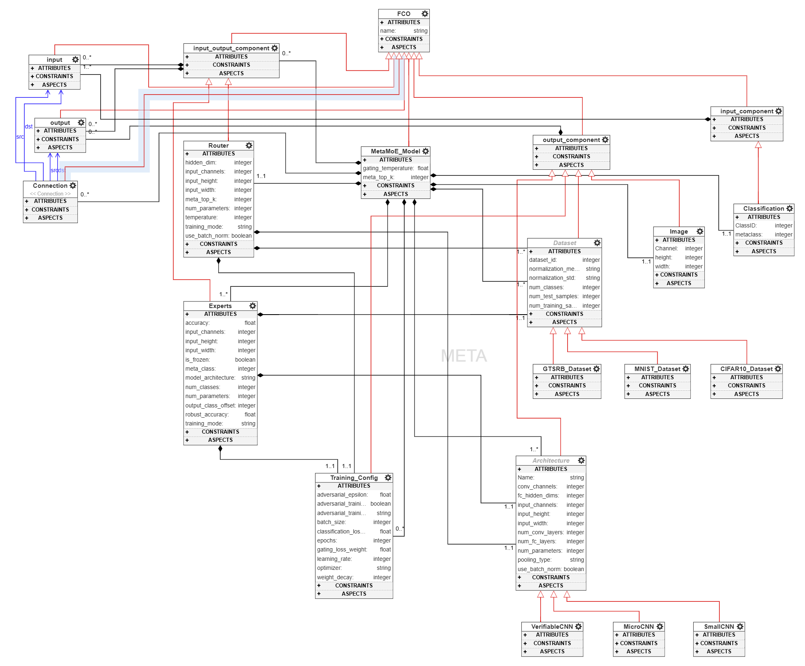
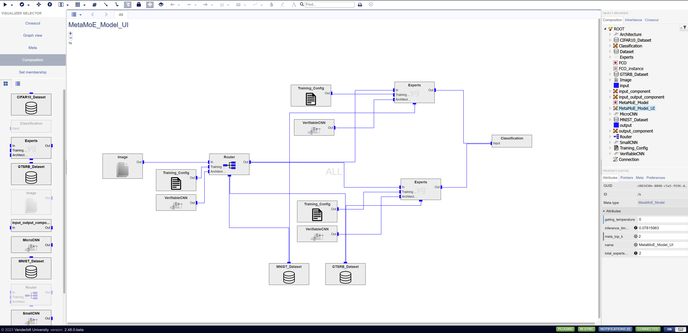

# Mixture-of-Experts Design Studio

## Research Overview: MetaMoE Framework

### Problem Statement

Mixture-of-Experts (MoE) architectures combine domain-specific experts through a routing network, but their robustness properties in heterogeneous settings remain unclear. This research investigates whether robustness guarantees compose: **Can component-level robustness (expert + router) yield system-level guarantees?**

### Core Hypothesis

MoE robustness decomposes compositionally:

**MoE robust ⟺ Router robust ∧ Selected Expert robust**

This enables modular verification where components are verified independently and guarantees compose without full-system re-verification.

### Results Summary

**Expert Robustness Dominance**
- Expert training method determines system robustness (13.15% adversarial accuracy difference)
- Router training has negligible impact (Δ < 0.1%) for dissimilar datasets
- Non-robust router training achieves 4.1× speedup with identical performance

**Compositional Verification**
- 100% router gating accuracy under adversarial attacks (for dissimilar datasets)
- Validates compositional property: verified router + verified expert = verified system
- Router achieves 100% certified robustness at practical threat models (ε ≤ 4/255)
- Experts require adversarial training for verifiability (CIFAR-10-NRT: 0% vs CIFAR-10-RT: 90% certified robustness)

**Empirical-Formal Correlation**
- Higher empirical adversarial accuracy reliably predicts higher certified robustness
- Certification gap varies by domain complexity (MNIST: 9.23%, CIFAR-10: 72.76%)
- Robust training is prerequisite for formal verifiability

**Scalability**
- Training time: Linear reduction with frozen experts
- Inference time: Linear scaling O(k) with active experts, not total experts N

### Practical Implications

1. Use adversarially trained experts for robustness-critical domains
2. Non-robust routers sufficient for dissimilar datasets (4.1× faster training)
3. Verify components independently and compose guarantees
4. Add experts incrementally without full-system retraining

---

## WebGME Design Studio

### 1. Meta Model



### 2. Design Studio



## WebGME Analysis Plugins

### 1. InferenceTimeEstimator

**Purpose**: Predicts MoE inference time based on total experts (N) and active experts (k).

**Model**: Quadratic regression
```
T = b0 + b1*k + b2*N + b3*kN + b4*k^2 + b5*N^2
```

**Features**:
- Auto-counts Expert nodes or accepts manual configuration
- Writes prediction to node attributes (default: `inference_time_estimate`)
- Shows results in modal dialog and Property Editor
- Validates linear scaling: inference cost scales with k, not N

**Configuration**:
- `totalExperts`: Total experts in system
- `activeExperts`: Experts activated per inference
- `outputAttributeName`: Attribute for prediction storage

**Usage**:
1. Select MetaMoE model node
2. Right-click → Plugins → InferenceTimeEstimator
3. Configure totalExperts and activeExperts
4. View prediction in dialog and Property Editor

---

### 2. ProcessingTimeEstimator

**Purpose**: Estimates expert training time based on dataset size. Supports single-dataset and multi-dataset scenarios with sequential/parallel processing comparison.

**Model**: Linear regression
```
T = 3.2620 + 0.001097 * num_images (minutes)
```

**Operating Modes**:

**Single Mode**
- Reads `num_training_samples` from selected Dataset node
- Writes estimates to `estimated_processing_time_minutes` and `estimated_processing_time_hours`
- Displays time in minutes, hours, and days

**Multiple Mode**
- Configure up to 3 datasets with type and sample count
- Compares sequential (1 GPU) vs. parallel (N GPUs) training
- Shows time savings from parallel processing
- Generates downloadable detailed report

**Configuration**:
- `mode`: single | multiple
- `modelType`: linear | polynomial
- `processingMode`: sequential | parallel (multiple mode)
- `datasetN_type`, `datasetN_samples`: Dataset configurations

**Usage - Single Mode**:
1. Select Dataset node with `num_training_samples` attribute
2. Right-click → Plugins → ProcessingTimeEstimator
3. Set mode to "single"
4. View estimate in dialog and Property Editor

**Usage - Multiple Mode**:
1. Select any node
2. Right-click → Plugins → ProcessingTimeEstimator
3. Set mode to "multiple"
4. Configure datasets and processingMode
5. View comparison and download report

**Reference Measurements** (VerifiableCNN):
- 26,000 images = 33 minutes
- 50,000 images = 54 minutes
- 60,000 images = 72 minutes

---

## Design Workflow

1. **Model Design**: Use MoE_Metamodel_ver1 plugin to create DSML with Experts, Router, Datasets
2. **Dataset Configuration**: Set `num_training_samples` on Dataset nodes
3. **Training Estimation**: Run ProcessingTimeEstimator to predict costs and compare strategies
4. **Expert Configuration**: Configure training method (NRT vs RT) based on robustness requirements
5. **Router Design**: Set top-k configuration (meta_top_k attribute)
6. **Inference Prediction**: Run InferenceTimeEstimator to predict latency
7. **System Optimization**: Balance accuracy, robustness, training time, and inference latency

---

## Additional Resources

- **Research Codebase**: [Mixture-of-Experts_Research](https://github.com/PMQ9/Mixture-of-Experts_Research)